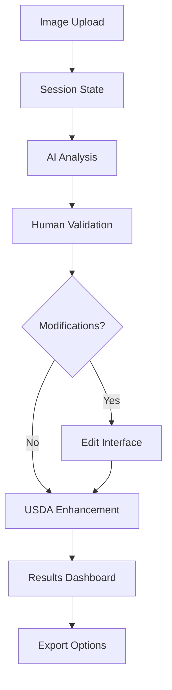

# 🍽️ Streamlit Web Application Guide

> **Complete guide to using the AI Nutrition Analyzer web interface**

This document provides detailed instructions for using the interactive Streamlit web application that powers the AI nutrition analysis system.

## 🌟 Application Overview

### ✨ Core Capabilities
- **🔍 Smart Image Analysis**: AI identifies dishes, ingredients, and portion sizes
- **👤 Human-in-the-Loop**: Review and refine AI results for maximum accuracy
- **🏛️ USDA Integration**: Enhanced nutrition data from official government database
- **📊 Rich Insights**: Interactive charts, detailed breakdowns, and export options
- **⚡ Real-time Processing**: Live progress tracking and instant feedback
- **📱 Mobile-Friendly**: Responsive design works great on all devices

### 🎯 Perfect For
- **Nutritionists & Dietitians**: Professional-grade nutrition analysis
- **Health Enthusiasts**: Track macros and micronutrients accurately
- **Researchers**: Analyze food composition for studies
- **Developers**: API integration and programmatic access

## ⚡ Quick Launch

### 🔧 Prerequisites

```bash
# 1. Install dependencies (choose one method)
uv sync                    # Using UV (recommended)
# OR
pip install -e .          # Using pip

# 2. Set up environment variables
cp .env.example .env      # Copy template
# Edit .env with your API keys
```

### 🔑 Required API Keys

| Service | Purpose | Get Key | Required |
|---------|---------|---------|----------|
| **OpenRouter** | AI Models | [Sign up](https://openrouter.ai/) | ✅ Yes |
| **USDA FoodData** | Enhanced Nutrition | [Sign up](https://fdc.nal.usda.gov/api-key-signup.html) | 🔶 Optional |

### 🚀 Start the Application

```bash
# Launch web interface
uv run streamlit run app.py

# Application opens at: http://localhost:8501
```

### 🔧 Optional: USDA Enhancement Setup

```bash
# For enhanced nutrition data
cd food-data-central-mcp-server
npm install && npm run build
cd ..
```

## 🎯 Step-by-Step User Guide

### 📱 Stage 1: Image Upload

**Multiple Input Options:**
- **📁 File Upload**: Drag & drop or browse (supports JPG, PNG, HEIC)
- **📷 Live Camera**: Take photos directly (mobile-optimized)
- **🖼️ Sample Images**: Try pre-loaded examples
- **📋 Clipboard**: Paste images directly

**✅ Upload Tips:**
- Maximum file size: 10MB
- Best results: Clear, well-lit food photos
- Multiple dishes: Include all items in frame

---

### 🤖 Stage 2: AI Analysis

**What Happens:**
1. **Vision Processing**: Advanced AI models analyze your image
2. **Ingredient Detection**: Identifies individual food items
3. **Portion Estimation**: Calculates serving sizes and weights
4. **Nutrition Calculation**: Estimates calories, macros, and nutrients

**🔄 Real-time Progress:**
- Live status updates
- Processing time estimates
- Cancel option available
- Error handling with retry

---

### ✋ Stage 3: Human Validation

**Review Interface:**
- **📊 Confidence Scores**: See AI certainty levels
- **🍽️ Identified Dishes**: All detected food items
- **📏 Portion Sizes**: Estimated weights and servings
- **⚠️ Warnings**: Potential issues or uncertainties

**Decision Options:**
- **✅ Approve**: Accept results as-is
- **✏️ Modify**: Make adjustments (next stage)
- **🔄 Re-analyze**: Try with different settings

---

### ✏️ Stage 4: Modifications (Optional)

**Editing Capabilities:**
- **🏷️ Dish Names**: Rename identified items
- **⚖️ Weight Adjustment**: Slider controls for portions
- **➕ Add Ingredients**: Include missing items
- **➖ Remove Items**: Delete incorrect identifications
- **🔄 Real-time Updates**: See nutrition impact immediately

**Smart Features:**
- **Auto-suggestions**: Common ingredient alternatives
- **Validation**: Prevents impossible values
- **Undo/Redo**: Easy change management

---

### ✨ Stage 5: USDA Enhancement (Optional)

**Enhanced Data Benefits:**
- **🏛️ Official Database**: USDA FoodData Central integration
- **🧪 Detailed Nutrients**: Vitamins, minerals, amino acids
- **📈 Higher Accuracy**: Professional-grade nutrition data
- **🤖 Smart Matching**: AI automatically finds best matches

**Process:**
1. AI agent searches USDA database
2. Matches ingredients to official entries
3. Replaces estimates with precise data
4. Shows before/after comparison

---

### 📊 Stage 6: Results Dashboard

**📈 Overview Tab:**
- Total calories and macro breakdown
- Daily value percentages
- Nutrition grade and health insights

**🥗 Ingredients Tab:**
- Per-ingredient nutrition breakdown
- Contribution percentages
- Detailed micro-nutrients

**📊 Charts Tab:**
- Interactive pie charts
- Macro distribution graphs
- Nutrient comparison visualizations

**📄 Analysis Tab:**
- Detailed AI analysis notes
- Confidence scores breakdown
- Processing metadata

**📤 Export Options:**
- **PDF Report**: Professional nutrition summary
- **CSV Data**: Spreadsheet-ready format
- **JSON**: Raw data for developers
- **Share Link**: Temporary result sharing (coming soon)

## ⚙️ Configuration & Settings

### 🎛️ Sidebar Configuration Panel

#### 🔑 API Management
```
┌─ API Configuration ─────────────────┐
│ OpenRouter Key: [●●●●●●●●] ✅ Valid │
│ USDA API Key:   [●●●●●●●●] ✅ Valid │
│ Connection Test: [Test APIs]        │
└─────────────────────────────────────┘
```

#### 🤖 AI Model Selection

**Vision Models** (Image Analysis):
- `qwen/qwen2.5-vl-72b-instruct:free` ⭐ **Recommended**
- `meta-llama/llama-3.2-11b-vision-instruct:free`
- `google/learnlm-1.5-pro-experimental:free`

**Language Models** (Text Processing):
- `meta-llama/llama-3.2-3b-instruct:free` ⭐ **Recommended**
- `microsoft/phi-3.5-mini-instruct:free`
- `google/gemma-2-9b-it:free`

*All models use free tiers - no charges!*

#### 📊 Analysis Controls
```
┌─ Processing Settings ──────────────┐
│ Confidence Threshold: [░░░░░▓] 75% │
│ Response Caching:     [✅] Enabled │
│ Debug Mode:          [  ] Disabled│
│ Auto-enhance USDA:   [✅] Enabled │
└────────────────────────────────────┘
```

#### 📈 System Monitoring
- **🔌 API Status**: Real-time connection monitoring
- **🏛️ USDA Availability**: Database connection status
- **⚡ Current Stage**: Active processing step
- **💾 Cache Stats**: Hit rates and storage usage

### 🔧 Advanced Options

**Performance Tuning:**
- Image resize quality
- Request timeout settings
- Concurrent processing limits
- Memory usage optimization

**Logging Configuration:**
- Log level (DEBUG, INFO, WARN, ERROR)
- Console vs file output
- Structured JSON logging
- Sensitive data filtering

**Developer Tools:**
- Raw API response viewer
- Processing time profiler
- Session state inspector
- Error trace display

## 🏗️ Technical Architecture

### 📁 Component Structure

```
streamlit_components/
├── 🔧 session_manager.py      # State management & persistence
├── 📤 image_uploader.py       # Multi-method image input
├── 📊 analysis_display.py     # AI results visualization
├── ✏️ modification_ui.py      # Human validation interface
├── ✨ usda_enhancement.py     # Government database integration
├── 📈 results_dashboard.py    # Final results & export
└── ⚙️ sidebar_config.py      # Settings & configuration

app.py                         # Main application orchestrator
```

### 🔄 Data Flow Architecture



### 🧠 State Management

**Session Persistence:**
- Multi-stage workflow tracking
- Configuration preservation
- Error state recovery
- Clean reset capabilities

**Real-time Updates:**
- Progress tracking
- Status synchronization
- Background processing
- User interaction feedback

## 🎨 User Experience Design

### 🎯 Design Principles

**🧠 Cognitive Load Reduction:**
- Single-focus interface per stage
- Clear progress indicators
- Intuitive navigation flow
- Minimal decision fatigue

**📱 Mobile-First Design:**
- Responsive layout adaptation
- Touch-friendly interactions
- Optimized image capture
- Thumb-zone navigation

**♿ Accessibility Features:**
- High contrast color schemes
- Screen reader compatibility
- Keyboard navigation support
- Clear visual hierarchy

### 🎨 Interface Highlights

#### 🏠 **Upload Experience**
```
┌─ Image Upload ──────────────────────┐
│  📁 Drag & Drop Zone               │
│  [📷 Camera] [📁 Browse] [🖼️ Samples]│
│                                    │
│  ✅ JPG, PNG, HEIC supported       │
│  📏 Max 10MB | 📱 Mobile optimized  │
└────────────────────────────────────┘
```

#### ⚡ **Analysis Progress**
```
┌─ AI Processing ────────────────────┐
│  🤖 Vision Analysis    [████████] │
│  🧮 Nutrition Calc    [████████] │
│  📊 Result Compile    [████████] │
│                                   │
│  ⏱️ Est. time: 15 seconds         │
│  [❌ Cancel]                      │
└───────────────────────────────────┘
```

#### 📊 **Results Dashboard**
```
┌─ Nutrition Overview ───────────────┐
│ 🔥 1,250 Cal │ 🥩 45g Pro │ 🌾 125g Car│
├─ Tabs ────────────────────────────┤
│ [📈 Overview] [🥗 Ingredients]     │
│ [📊 Charts]   [📄 Analysis]        │
├─ Actions ──────────────────────────┤
│ [📄 PDF] [📊 CSV] [💾 JSON] [🔗 Share]│
└────────────────────────────────────┘
```

## 🔧 Technical Excellence

### 🚀 Performance Optimization

**💾 Smart Caching System:**
- API response caching (reduces costs)
- Image processing cache (faster re-analysis)
- Model result persistence (offline viewing)
- Automatic cache cleanup (storage management)

**⚡ Efficient Processing:**
- Lazy component loading
- Background image processing
- Progressive result streaming
- Memory usage optimization

**📡 Network Optimization:**
- Request batching and queuing
- Automatic retry with exponential backoff
- Connection pooling
- Bandwidth-adaptive image compression

### 🛡️ Robust Error Handling

**🎯 User-Friendly Messages:**
```python
❌ "Image too large (15MB). Please use images under 10MB."
🔑 "OpenRouter API key missing. Add it in the sidebar settings."
🌐 "Network timeout. Check your internet and try again."
⚠️  "Low confidence in results. Consider re-taking the photo."
```

**🔄 Graceful Degradation:**
- USDA enhancement optional fallback
- Model switching on API failures
- Partial result recovery
- Offline mode capabilities

**🐛 Developer Tools:**
- Debug mode with full stack traces
- API request/response logging
- Performance profiling
- Session state inspection

### 🔒 Security & Privacy

**🛡️ Data Protection:**
- No permanent image storage
- Automatic temporary file cleanup
- API key encryption in session state
- No analytics or tracking

**🔐 Secure Communication:**
- HTTPS-only API calls
- Request signing and validation
- Rate limiting compliance
- Error message sanitization

## 🔍 Troubleshooting Guide

### 🚨 Common Issues & Solutions

#### 🔑 Authentication Problems

**"OpenRouter API key required"**
```bash
✅ Solution 1: Use sidebar settings
1. Open sidebar (← button)
2. Enter API key in "API Configuration"
3. Click "Test APIs" to verify

✅ Solution 2: Use .env file
1. Create .env file in project root
2. Add: OPENROUTER_API_KEY=your_key_here
3. Restart the application
```

**"Invalid API key format"**
```bash
🔍 Check your key format:
✅ Correct: sk-or-v1-abc123...
❌ Wrong:   abc123 (missing prefix)
❌ Wrong:   "sk-or-v1..." (has quotes)
```

#### 📤 Upload Issues

**"File upload failed"**
```bash
📋 Checklist:
□ File size under 10MB?
□ Format is JPG, PNG, or HEIC?
□ Image not corrupted?
□ Browser permissions granted?

🔧 Try:
- Reduce image size/quality
- Use different browser
- Clear browser cache
```

**"Camera not working"**
```bash
📱 Mobile troubleshooting:
1. Grant camera permissions
2. Use HTTPS (not HTTP)
3. Try different browser
4. Check camera app works

💻 Desktop troubleshooting:
1. Check webcam connection
2. Close other camera apps
3. Grant browser permissions
4. Try browser restart
```

#### 🤖 Analysis Problems

**"Analysis timeout" / "Taking too long"**
```bash
🌐 Network issues:
- Check internet speed
- Try smaller image file
- Switch to mobile hotspot
- Restart router/modem

⚙️ Configuration:
- Try different AI model
- Disable USDA enhancement
- Clear cache in settings
```

**"Low confidence results"**
```bash
📷 Image quality tips:
✅ Good lighting (natural preferred)
✅ Clear focus on food
✅ Minimal background clutter
✅ Multiple angles if complex

🔄 Retry options:
- Take new photo
- Adjust crop/zoom
- Try different model
- Use manual modifications
```

#### 🏛️ USDA Enhancement Issues

**"USDA enhancement unavailable"**
```bash
🔧 Setup checklist:
1. Add USDA API key to settings
2. Build MCP server:
   cd food-data-central-mcp-server
   npm install && npm run build
3. Restart application
4. Check sidebar status indicator
```

### 🐛 Debug Mode

**Enable Advanced Diagnostics:**
1. Open sidebar settings
2. Toggle "Debug Mode" ON
3. Refresh page for full logs

**Debug Information Includes:**
- 🔍 Complete session state
- 📡 API request/response logs
- ⚡ Performance timing metrics
- 🚨 Detailed error stack traces
- 💾 Cache hit/miss statistics

**📊 Performance Monitoring:**
```
┌─ Debug Dashboard ──────────────────┐
│ API Calls: 3 │ Cache Hits: 67%   │
│ Load Time: 2.3s │ Memory: 45MB    │
│ Errors: 0 │ Warnings: 1        │
└────────────────────────────────────┘
```

### 📞 Getting Help

**🆘 Still having issues?**
1. **Enable debug mode** and reproduce the issue
2. **Screenshot the error** and debug info
3. **Check GitHub issues** for known problems
4. **Create new issue** with:
   - Steps to reproduce
   - Debug mode screenshots
   - Browser and OS version
   - API keys status (don't share actual keys!)

**📚 Additional Resources:**
- [Main README](README.md) - General project info
- [GitHub Issues](https://github.com/yourusername/calorie_app/issues) - Known problems
- [OpenRouter Docs](https://openrouter.ai/docs) - API documentation
- [USDA API Docs](https://fdc.nal.usda.gov/api-guide.html) - Database info

## 🌐 Deployment & Production

### 🚀 Local Development

**Development Server:**
```bash
# With auto-reload (recommended for development)
uv run streamlit run app.py --server.runOnSave=true

# With custom port
uv run streamlit run app.py --server.port 8080

# With debug logging
LOG_LEVEL=DEBUG uv run streamlit run app.py
```

**Development Features:**
- 🔄 Auto-reload on file changes
- 🐛 Debug mode enabled
- 📊 Performance profiling
- 🔍 Detailed error traces

### ☁️ Production Deployment

#### **Streamlit Community Cloud** ⭐ Recommended
```bash
# 1. Push to GitHub
git add .
git commit -m "Deploy to Streamlit Cloud"
git push origin main

# 2. Visit https://share.streamlit.io
# 3. Connect GitHub repo
# 4. Add secrets (API keys)
# 5. Deploy!
```

**Required Secrets:**
```toml
# In Streamlit Cloud secrets
OPENROUTER_API_KEY = "your_key_here"
USDA_API_KEY = "your_usda_key_here"
```

#### **Heroku Deployment**
```bash
# 1. Create Heroku app
heroku create your-nutrition-app

# 2. Set environment variables
heroku config:set OPENROUTER_API_KEY=your_key
heroku config:set USDA_API_KEY=your_usda_key

# 3. Deploy
git push heroku main
```

**Heroku Configuration:**
- Procfile included in repo
- Automatic buildpack detection
- Environment variable management
- Free tier available

#### **Docker Deployment**
```dockerfile
# Dockerfile (create this)
FROM python:3.11-slim

WORKDIR /app
COPY . .

RUN pip install -e .

EXPOSE 8501

CMD ["streamlit", "run", "app.py", "--server.port=8501", "--server.address=0.0.0.0"]
```

```bash
# Build and run
docker build -t nutrition-analyzer .
docker run -p 8501:8501 \
  -e OPENROUTER_API_KEY=your_key \
  -e USDA_API_KEY=your_usda_key \
  nutrition-analyzer
```

#### **Cloud Platform Deployment**

**AWS (ECS/Fargate):**
- Container-based deployment
- Auto-scaling capabilities
- Load balancer integration
- CloudWatch monitoring

**Google Cloud (Cloud Run):**
- Serverless container platform
- Pay-per-request pricing
- Automatic scaling
- Easy CI/CD integration

**Azure (Container Instances):**
- Quick container deployment
- Resource group management
- Application Gateway support
- Monitor with Application Insights

### 🔧 Production Configuration

**Required Environment Variables:**
```bash
# Core application
OPENROUTER_API_KEY=your_openrouter_key
OPENROUTER_API_URL=https://openrouter.ai/api/v1
USDA_API_KEY=your_usda_key

# Streamlit configuration
STREAMLIT_SERVER_PORT=8501
STREAMLIT_SERVER_ADDRESS=0.0.0.0
STREAMLIT_SERVER_HEADLESS=true
STREAMLIT_BROWSER_GATHER_USAGE_STATS=false

# Application settings
LOG_LEVEL=INFO
CACHE_ENABLED=true
MAX_UPLOAD_SIZE=10
```

**Performance Optimization:**
```bash
# Resource limits
STREAMLIT_SERVER_MAX_UPLOAD_SIZE=10
STREAMLIT_SERVER_ENABLE_XSRF_PROTECTION=true

# Caching
CACHE_TTL=3600
CACHE_MAX_SIZE=100

# Security
SESSION_TIMEOUT=1800
API_RATE_LIMIT=100
```

### 📊 Monitoring & Analytics

**Health Checks:**
```python
# Add to your deployment
@st.cache_data
def health_check():
    return {
        "status": "healthy",
        "timestamp": datetime.now(),
        "version": "1.0.0"
    }
```

**Logging:**
```python
# Production logging setup
import logging

logging.basicConfig(
    level=logging.INFO,
    format='%(asctime)s - %(name)s - %(levelname)s - %(message)s'
)
```

**Metrics to Monitor:**
- 📈 Request volume and response times
- 🔑 API key usage and rate limits
- 💾 Memory and CPU utilization
- 🚨 Error rates and types
- 👥 User session statistics

## 🚀 Roadmap & Future Enhancements

### 🎯 Phase 1: Core Improvements (Next 3 months)

- [ ] **👤 User Accounts & History**
  - Personal nutrition tracking
  - Analysis history and trends
  - Custom preferences and allergies
  - Export historical data

- [ ] **📱 Mobile Optimization**
  - Progressive Web App (PWA)
  - Offline analysis capabilities
  - Camera optimization
  - Touch gesture support

- [ ] **🔍 Enhanced Analysis**
  - Barcode scanning integration
  - Recipe nutrition analysis
  - Meal planning suggestions
  - Ingredient substitution recommendations

### 🌟 Phase 2: Advanced Features (6 months)

- [ ] **🤝 Social & Sharing**
  - Share analysis results
  - Community recipe database
  - Nutrition challenges
  - Social meal tracking

- [ ] **🧠 AI Improvements**
  - Custom model fine-tuning
  - Multi-language support
  - Voice input and commands
  - Dietary restriction awareness

- [ ] **📊 Advanced Analytics**
  - Macro/micro trend analysis
  - Nutrition goal tracking
  - Health insights and recommendations
  - Integration with fitness apps

### 🚀 Phase 3: Platform Expansion (1 year)

- [ ] **📲 Native Mobile Apps**
  - iOS and Android apps
  - Apple HealthKit integration
  - Google Fit integration
  - Wearable device support

- [ ] **🔗 API & Integrations**
  - Public API for developers
  - Restaurant menu integration
  - Grocery delivery apps
  - Telehealth platform connections

- [ ] **🏢 Enterprise Features**
  - Multi-tenant architecture
  - Advanced user management
  - White-label solutions
  - Custom branding options

### 💡 Innovation Ideas

**🥽 AR/VR Integration:**
- Augmented reality portion sizing
- Virtual nutrition coaching
- 3D food modeling

**🧬 Personalization:**
- Genetic-based nutrition recommendations
- AI-powered meal planning
- Adaptive dietary suggestions

**🌍 Global Expansion:**
- Regional food databases
- Local cuisine expertise
- Cultural dietary preferences
- Multi-currency pricing

---

**💬 Have ideas or suggestions?**
[Create an issue](https://github.com/yourusername/calorie_app/issues) or contribute to the project!

## 🤝 Contributing to the Streamlit App

### 🎯 Areas for Contribution

**🎨 UI/UX Improvements:**
- New chart types and visualizations
- Mobile responsiveness enhancements
- Accessibility features
- Design system components

**⚡ Performance Optimizations:**
- Caching strategies
- Image processing improvements
- Background task management
- Memory usage optimization

**🔧 New Features:**
- Export format additions
- Integration with external services
- Advanced filtering options
- Customizable dashboard layouts

### 🛠️ Development Setup

```bash
# 1. Fork and clone
git clone https://github.com/yourusername/calorie_app.git
cd calorie_app

# 2. Create development environment
uv sync
cp .env.example .env
# Add your API keys to .env

# 3. Start development server
uv run streamlit run app.py --server.runOnSave=true
```

### 🧪 Testing Streamlit Components

```bash
# Test specific components
uv run python -c "from streamlit_components import image_uploader; print('OK')"

# Run integration tests
uv run pytest tests/streamlit/ -v

# Test with different browsers
# Chrome, Firefox, Safari, Mobile browsers
```

### 📝 Component Guidelines

**🏗️ Architecture Principles:**
- Single responsibility per component
- Clean separation of concerns
- Stateless components where possible
- Comprehensive error handling

**🎨 UI Standards:**
- Follow existing design patterns
- Use consistent color scheme
- Maintain responsive layout
- Include loading states

**📊 Code Quality:**
- Add docstrings to all functions
- Include type hints
- Write unit tests
- Follow PEP 8 style guide

### 🚀 Deployment Testing

**Local Testing:**
```bash
# Test production configuration
STREAMLIT_SERVER_HEADLESS=true uv run streamlit run app.py

# Test with environment variables
OPENROUTER_API_KEY=test_key uv run streamlit run app.py
```

**Cloud Testing:**
- Deploy to staging environment
- Test with real API keys
- Verify mobile functionality
- Check performance under load

---


---

<div align="center">

## 🍽️ Ready to Start Analyzing?

**Launch the app and discover the nutrition in your food!**

```bash
uv run streamlit run app.py
```

[📖 Main README](README.md) • [🐛 Report Issues](https://github.com/yourusername/calorie_app/issues) • [💡 Request Features](https://github.com/yourusername/calorie_app/issues/new)

**Happy analyzing! ✨**

</div>